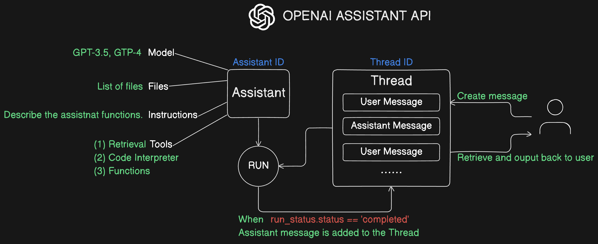
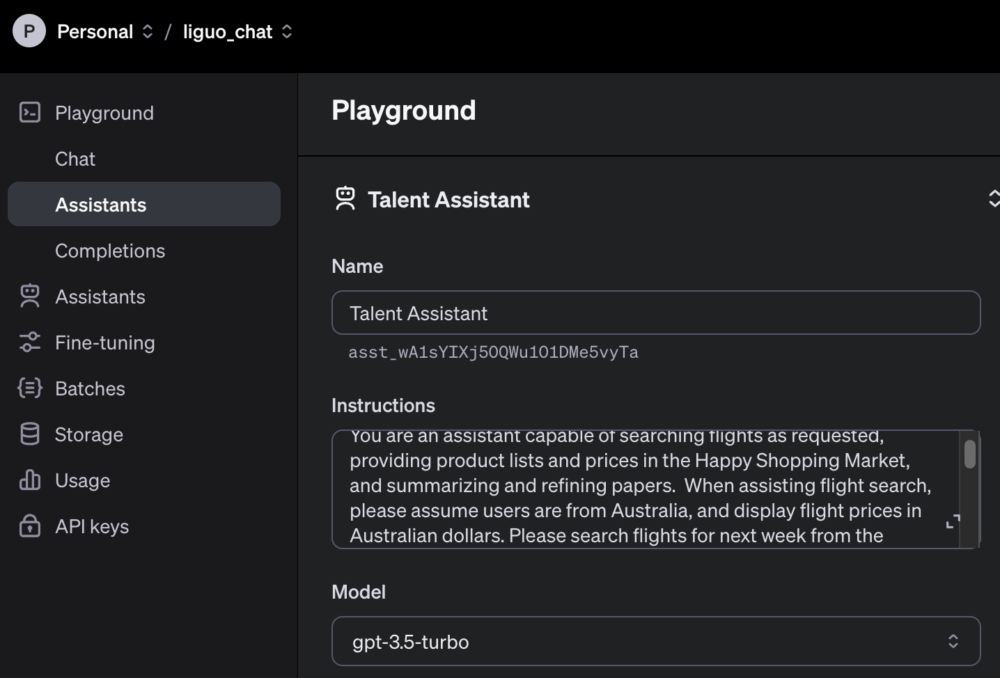
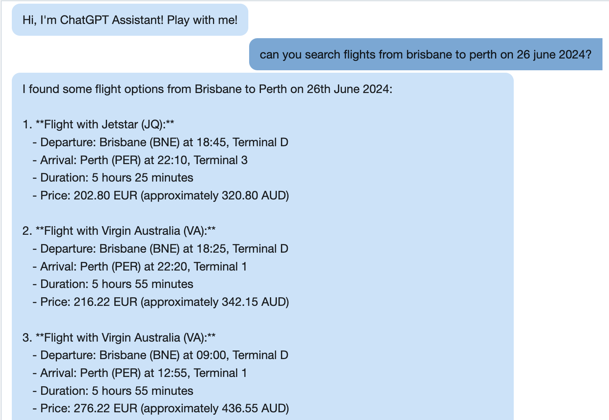
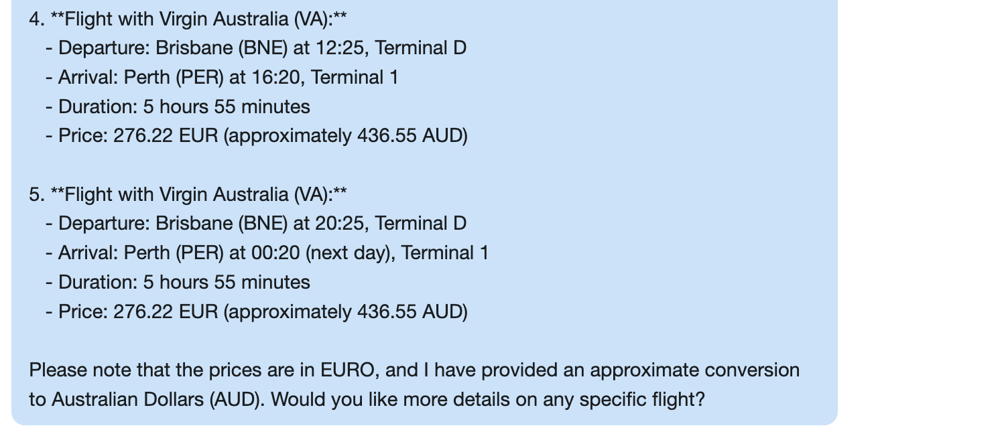
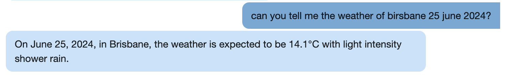
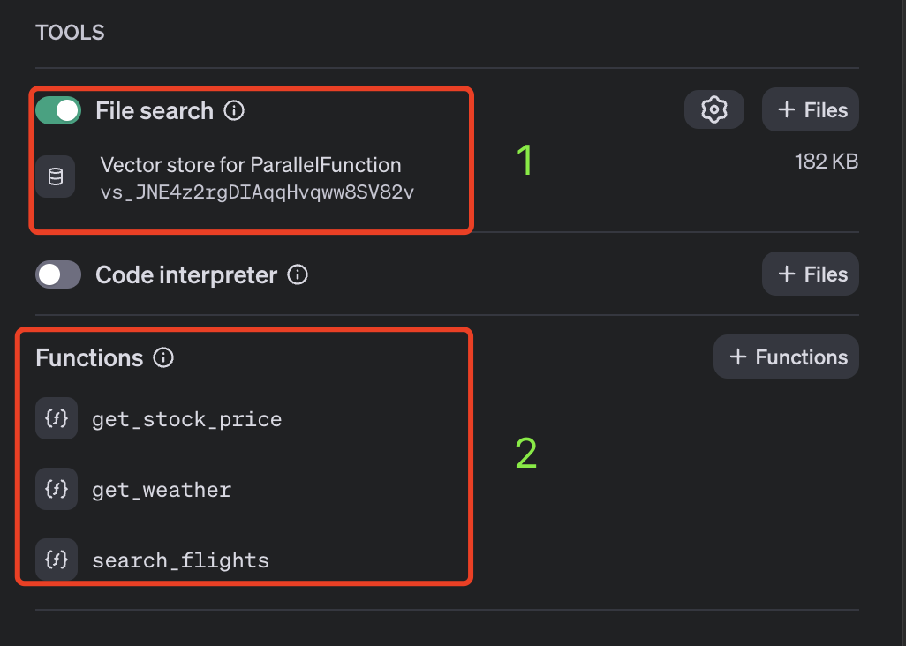
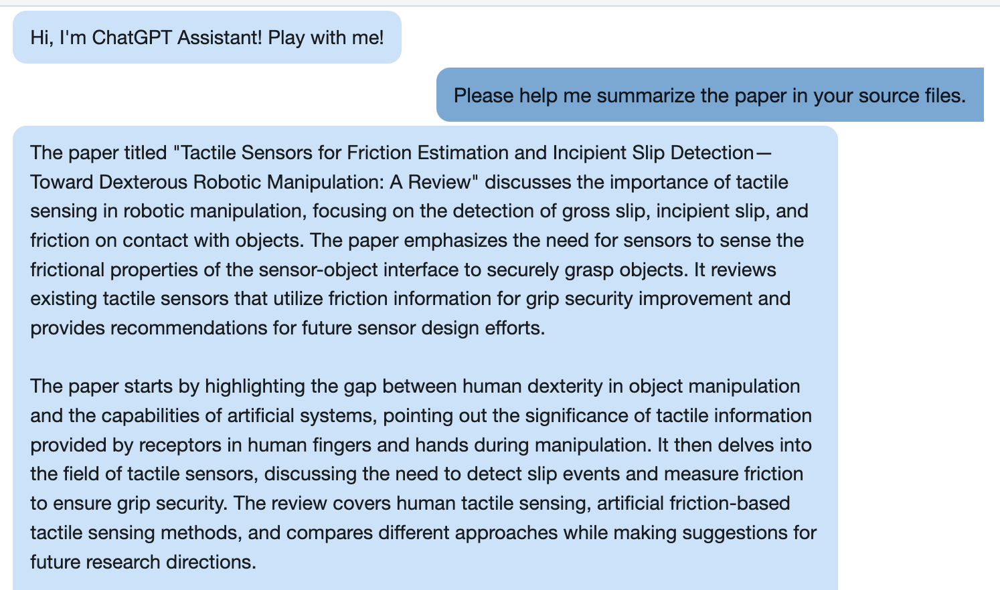
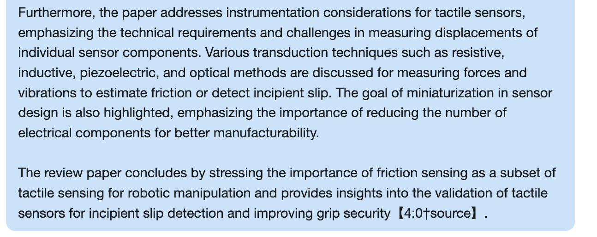
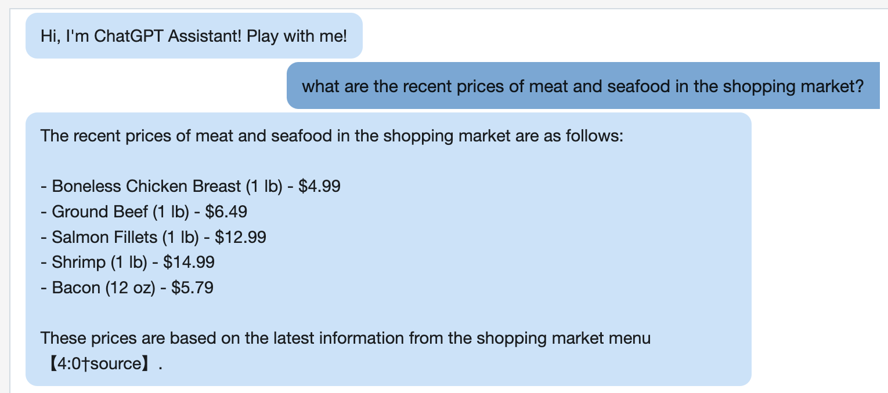

#### 1. This chatbot uses OPENAI's Assistants API and ChatAPI
- Assistants API

- Chat API: https://api.openai.com/v1/chat/completions

#### 2. Mainly tests the Assistants API. This application uses the functions and retrieval functions of this module.
- Configuration in OpenAI

- Three Functions
    - search_flights (waiting time for reply is about 20 seconds): OpenAi will search flight from external AMADEUS API.
    
    
    - get_stock_price (waiting time for reply is about 10 seconds)
    
    - get_weather (waiting time for reply is about 10 seconds)
    

- File Search (2 files, see chatbot-backend folder)

  `Tactile_Sensors_for_Friction_Estimation_and_Incipient_Slip_DetectionToward_Dexterous_Robotic_Manipulation_A_Review.pdf`
  `shopping_market_menu_price.txt`

  - Search paper (waiting time for reply is about 15 seconds)
  
  
  - Search menu price (waiting time for reply is about 12 seconds)

can you search flight from brisbane to perth on 26 june 2024
can you tell the stock price of tesla
can you tell the weather of brisbane on 25 june 2024
Please help me summarize the paper in your source files.
what are the recent prices of meat and seafood in the shopping market